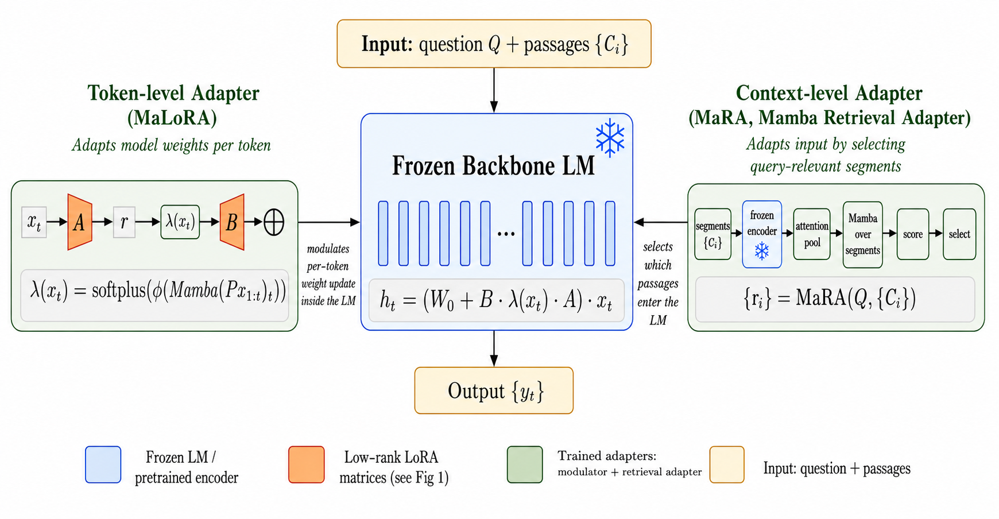

# Selective State-Space Adaptation and Retrieval for Language Model Reasoning

Code and configurations for the EMNLP 2026 Main Track paper.

**Atahan Dokme**, **Larry Heck**  
AI Virtual Assistant (AVA) Lab, Georgia Institute of Technology

Low-rank adaptation learns one static update and applies it identically to every
input. This work adds **selective state-space control at two granularities**
around a frozen backbone, so that adaptation responds to the input rather than
being fixed by training.



**MaLoRA** (left) is a *token-level* modulator. A Mamba block runs over the
projected token sequence and emits a scalar `λ(x_t)` that rescales the LoRA
update at each token. Because the recurrence carries state across tokens, the
adapter strength at position *t* reflects the whole trajectory up to *t*, not
just the current token.

**MaRA** (right) is a *context-level* retrieval adapter. Each candidate
paragraph is encoded by the first *K* frozen layers, pooled to one embedding,
and passed through a Mamba block that runs **over segments**. A scoring head
then selects the top-`k` paragraphs, which are all the language model sees.

The two never overlap: a per-token scalar cannot remove a paragraph from the
context, and a per-segment selection cannot vary adapter strength across the
tokens it admits. Both read the frozen backbone's own hidden states, so MaRA
adds roughly 3M parameters and no separate retrieval encoder.

Evaluated on MuSiQue and 2WikiMultihopQA across Qwen-2.5-7B, Llama-3.1-8B and
Gemma-2-9B, the combined system improves over LoRA on every cell of the grid.

## Installation

```bash
pip install -r requirements.txt
```

Python 3.10. Install the `torch` build matching your driver; results were
produced with `2.5.1+cu121` on A100-class GPUs.

## Step 1 — Build the canonical training pool

Every method trains on identical examples, so cross-method differences are not
attributable to different data. The builder takes no arguments:

```bash
python data/dump_canonical_10k.py
```

An example is admitted only if it fits the sequence budget under **both** the
Qwen and Llama tokenizers and passes a chunk-detection check under both.
Selection is stratified by hop count (MuSiQue) or question type (2Wiki) at
seed 42. Writes `data/preprocessed_10k/*_canonical_n10000.json`.

MuSiQue is pulled from the Hub automatically. 2WikiMultihopQA is read from the
`voidful/2WikiMultihopQA` snapshot, downloaded on first use; set `TWOWIKI_DIR`
to reuse an existing local copy containing `train.json` / `dev.json`.

## Step 2 — Train MaLoRA

```bash
python train/train_malora.py \
  --config configs/canonical_pool/musique_malora_n1d16_scalar_r16_qwen.yaml
```

Writes a checkpoint, `config.yaml`, `metrics.json` and `diagnostics.jsonl` to
the config's `output_root`. The same script trains every token-level variant;
which one you get is set by `gate_type` and `scalar_output` in the config (see
[Naming](#naming-paper--code)).

LoRA / DoRA / AdaLoRA baselines use `train/train_lora.py` with the same interface.

## Step 3 — Train MaRA

MaRA is a separate stage, trained against the **unadapted** backbone with no
modulator attached:

```bash
python train/train_mara.py \
  --model Qwen/Qwen2.5-7B --dataset musique --epochs 2 \
  --lora-pool-path data/preprocessed_10k/musique_canonical_n10000.json \
  --pos-weight 8.0 --pairwise-weight 0.5 --pairwise-margin 1.0 \
  --chain-passes 4 --batch-size 2 --grad-accum 2 \
  --out-dir outputs/mara_mq_qwen
```

The three loss and pass-budget flags above are **required** to reproduce the
paper. Their argparse defaults (`4.0`, `0.0`, `0`) are not the reported setting:
Appendix A specifies positive-class BCE weight `8.0`, pairwise margin weight
`0.5` at margin `1.0`, and `N_p = 4` chained passes on both datasets.

The remaining defaults do reproduce the paper (`--mamba-dim 256
--mamba-n-layers 2 --mamba-d-state 64 --encoder-K 16 --seed 0`), giving a
2.86M-parameter adapter on Qwen. Set `--encoder-K 12` for Llama, and `--encoder-K
20` for Gemma on MuSiQue (`16` on 2WikiMultihopQA). Writes `router_best.pt`.

## Step 4 — Evaluate

Token-level modulator alone, full context:

```bash
python eval/eval_musique.py --model Qwen/Qwen2.5-7B \
  --malora-checkpoint outputs/<run>/gated_lora_epoch_2.pt --num-beams 4
```

The full system, MaLoRA + MaRA at top-`k`:

```bash
python eval/eval_evidence_interface.py \
  --model Qwen/Qwen2.5-7B --dataset musique --mode topk_score --top-k 12 \
  --ckpt outputs/<run>/gated_lora_epoch_2.pt \
  --router-ckpt outputs/mara_mq_qwen/router_best.pt \
  --chain-passes 4 \
  --out-dir outputs/eval_system
```

`--chain-passes 4` is again required: it defaults to `0`, which performs
single-pass selection instead of the paper's `N_p = 4` chained procedure and
undershoots the reported MuSiQue recall.

`--mode` selects the retrieval condition, which is how the paper's ablations are
reproduced:

| mode | meaning |
|---|---|
| `all_original` | full candidate set, no retrieval |
| `topk_score` | MaRA selects top-`k` |
| `oracle_topk` | gold paragraphs, padded to `k` |
| `gold_only` | gold paragraphs only, no padding |
| `topk_bm25` | BM25 selects top-`k` |
| `random_topk` | random `k` (generation-cost control) |

Use `k=12` on MuSiQue and `k=4` on 2WikiMultihopQA, as in the paper.

Other entry points: `eval/eval_twowikimultihopqa.py`, `eval/eval_ruler.py`
(RULER QA-2), `eval/eval_commonsense.py`, `eval/eval_gsm_variants.py`
(GSM8K / GSM-hard), `train/train_dense_retriever.py` (E5 / Contriever / BGE
retrieval baselines).

## Naming: paper ↔ code

The code predates the paper's terminology. **Config filenames are not a reliable
guide** — `musique_hproj_scalar_r16_qwen.yaml` is the *stateless* baseline, not
MaLoRA. Check `gate_type` and `scalar_output` inside the file:

| Paper | `gate_type` | `scalar_output` |
|---|---|---|
| **MaLoRA** | `mamba` | `true` |
| **TopLoRA** (stateless baseline) | `toplora` | `false` |
| stateless scalar (Appendix C) | `linear` | `true` |
| stateful diagonal (Appendix C) | `mamba` | `false` |

MaLoRA configs are named `*_malora_n1d16_scalar_*`. In code, MaLoRA lives in
`model/malora.py` and MaRA in `mara/mara.py` (class `EvidenceRouter`).

## Layout

```
train/                     training entry points
  train_malora.py            MaLoRA, TopLoRA and the modulator ablations
  train_lora.py              LoRA / DoRA / AdaLoRA baselines
  train_mara.py              retrieval adapter
  train_dense_retriever.py   dense retrieval baselines
eval/                      evaluation entry points
model/malora.py            token-level modulator
mara/mara.py               retrieval adapter model
chunking/                  paragraph detection, segment-labelled datasets
data/                      pool builder and dataset formatters
configs/canonical_pool/    paper configs and retained ablation configs
configs/legacy/            superseded drafts, not used for any reported run
results/metrics/           per-run training time, parameters, peak memory
figures/
```

`results/metrics/` holds the per-cell numbers behind the adapter rows of the
efficiency table: trainable parameters, end-to-end training time, peak GPU
memory and per-epoch losses. The MaRA-alone row is produced by the retrieval
adapter's own training run and is not included here. Files are named
`{MU,TW}_{backbone}_{method}_s{seed}.json`. Averaging a method's six
MuSiQue/2WikiMultihopQA cells reproduces its row of the efficiency table
exactly, for parameters, training time and peak memory alike.

| file | paper | `gate_type` / `output_type` |
|---|---|---|
| `*_lora_*` | LoRA baseline (Tables 4, 6) | none |
| `*_adalora_*` | AdaLoRA (Table 6) | none |
| `*_dora_*` | DoRA (Table 6) | none |
| `*_toplora_*` | TopLoRA (Table 4) | `toplora` / `diag` |
| `*_malora_*` | MaLoRA (Table 4) | `mamba` / `scalar` |
| `*_stateless-scalar_*` | stateless scalar (Appendix C) | `linear` / `scalar` |
| `*_stateful-diagonal_*` | stateful diagonal (Appendix C) | `mamba` / `diag` |

The `method` field *inside* each file is the identifier the training run
recorded, and predates the paper's terminology.

The per-cell batch size and gradient-accumulation factor vary, as recorded in
each config and reported in Appendix A. They are matched across methods within
a cell, with one exception: on 2WikiMultihopQA with Gemma-2-9B, TopLoRA and the
Appendix C variants use `1 x 8` where the other methods use `1 x 4`.

This archive does not retain every seed used for the headline accuracy
results. Seed coverage for those follows Appendix A of the paper. The files
here are what remains of the training runs, and they are sufficient to
reproduce the reported efficiency aggregates: LoRA and MaLoRA retain three
seeds per cell, TopLoRA three on Qwen and one elsewhere, and AdaLoRA and DoRA
one throughout. Parameter counts are architectural, and training time and peak
memory vary little across seeds, so the aggregates are not sensitive to which
seeds survived.

## Notes

- The training entry points retain `--dataset` branches for datasets outside
  this paper (`qasper`, `drop`, `quality`, `law`, `narrativeqa`, `govreport`,
  `mixture`). Those loader modules are legacy research code and are not
  included, so those branches raise `ImportError`. Only the datasets documented
  above are supported.
- Checkpoints are not released. MaLoRA costs ~10–20 GPU-hours per cell and MaRA
  ~2.5; both retrain from the configs here.
- The evaluation scripts also expose adapter variants not reported in the paper.
- The state-space blocks use `mambapy` (pure PyTorch), not fused CUDA kernels,
  so wall-clock figures understate an optimised implementation.

## Citation

```bibtex
@inproceedings{dokme2026selective,
  title     = {Selective State-Space Adaptation and Retrieval for Language Model Reasoning},
  author    = {Dokme, Atahan and Heck, Larry},
  booktitle = {Proceedings of the 2026 Conference on Empirical Methods in Natural Language Processing},
  year      = {2026}
}
```

## License

MIT. See `LICENSE`.
